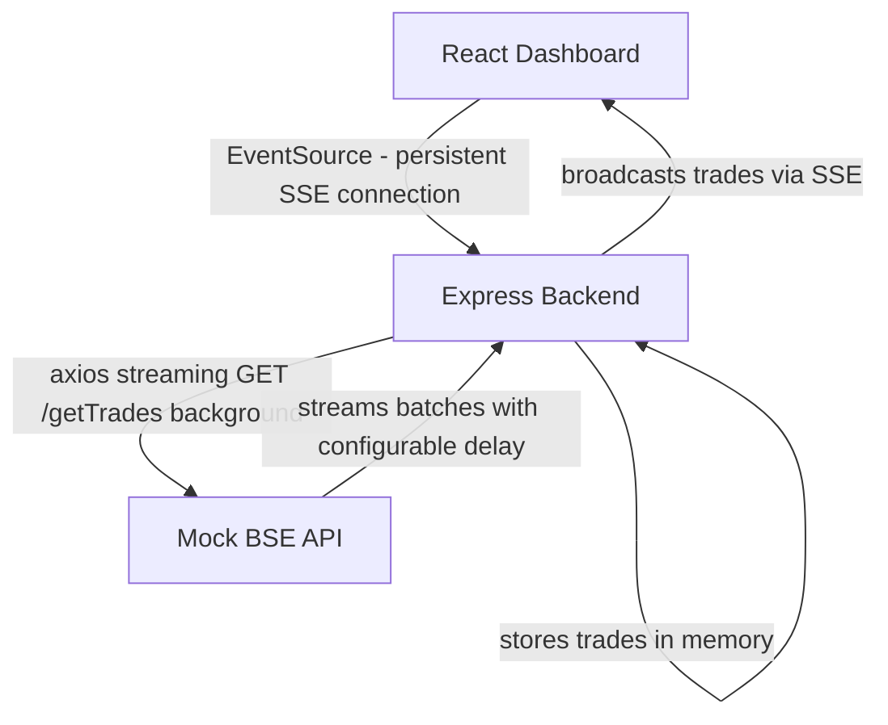

# Architecture Note

## Diagram

## Why This Design

**Why SSE over WebSockets?**
Data flows one way — server to client only. SSE is purpose built 
for this. WebSockets add bidirectional complexity that this use 
case doesn't need. EventSource is natively supported in all 
browsers with no extra libraries.

**Why background pull over request-response?**
The BSE pull takes 15 minutes. HTTP connections die at 30 seconds. 
Running the pull as a background process on the server decouples 
it from any client connection entirely. The POST /api/pull returns 
immediately — pull runs independently.

**Why in-memory storage?**
Trades are stored in a server-side array as they arrive. New SSE 
clients connecting mid-pull immediately receive all trades pulled 
so far — dashboard never shows blank screen.

**Why no polling, no cron?**
Polling creates hundreds of unnecessary requests over 15 minutes. 
Cron runs on schedule, not on demand. SSE solves both — one 
connection, zero wasted requests, instant updates.
